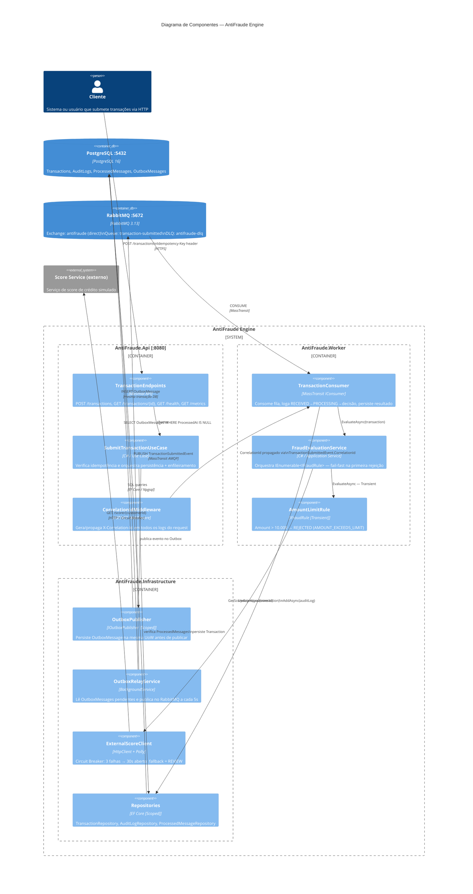

# Diagrama de Componentes — AntiFraude Engine

## Legenda

| Componente | Lifetime DI | Descrição |
|---|---|---|
| `CorrelationIdMiddleware` | Singleton (middleware) | Enriquece Serilog LogContext com CorrelationId |
| `AmountLimitRule` | **Transient** | Instância isolada por avaliação; sem estado compartilhado |
| `FraudEvaluationService` | Scoped | Orquestrador de regras por request/mensagem |
| `OutboxPublisher` | Scoped | Mesma UoW do DbContext |
| `OutboxRelayService` | Singleton (hosted) | BackgroundService do host |
| `ExternalScoreClient` | Singleton (HttpClient) | Estado do Circuit Breaker compartilhado globalmente |
| `TransactionRepository` | Scoped | Mesmo DbContext do escopo |
