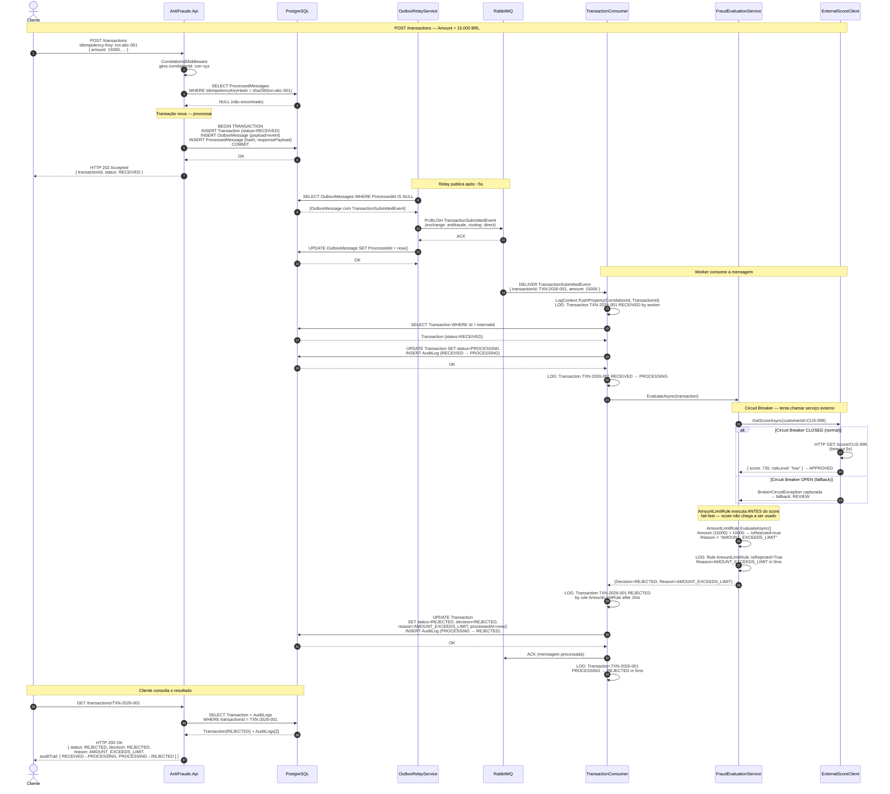
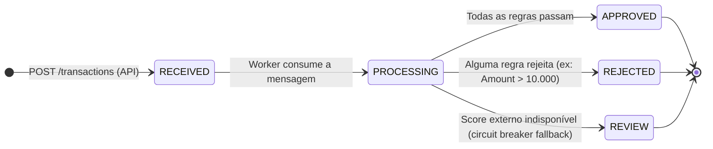

# Diagrama de Sequência — Transação REJECTED (Amount = 15.000)

Cenário completo: cliente envia transação de R$ 15.000, que é rejeitada pela regra `AmountLimitRule`.

```mermaid
sequenceDiagram
    autonumber

    actor Client as Cliente
    participant API as AntiFraude.Api
    participant DB as PostgreSQL
    participant Outbox as OutboxRelayService
    participant MQ as RabbitMQ
    participant Worker as TransactionConsumer
    participant Rules as FraudEvaluationService
    participant Score as ExternalScoreClient

    Note over Client,Score: POST /transactions — Amount = 15.000 BRL

    Client->>API: POST /transactions<br/>Idempotency-Key: txn-abc-001<br/>{ amount: 15000, ... }

    API->>API: CorrelationIdMiddleware<br/>gera correlationId: corr-xyz

    API->>DB: SELECT ProcessedMessages<br/>WHERE IdempotencyKeyHash = sha256(txn-abc-001)
    DB-->>API: NULL (não encontrado)

    Note over API: Transação nova — processar

    API->>DB: BEGIN TRANSACTION<br/>INSERT Transaction (status=RECEIVED)<br/>INSERT OutboxMessage (payload=event)<br/>INSERT ProcessedMessage (hash, responsePayload)<br/>COMMIT
    DB-->>API: OK

    API-->>Client: HTTP 202 Accepted<br/>{ transactionId, status: RECEIVED }

    Note over Outbox,MQ: Relay publica após ~5s

    Outbox->>DB: SELECT OutboxMessages WHERE ProcessedAt IS NULL
    DB-->>Outbox: [OutboxMessage com TransactionSubmittedEvent]

    Outbox->>MQ: PUBLISH TransactionSubmittedEvent<br/>(exchange: antifraude, routing: direct)
    MQ-->>Outbox: ACK

    Outbox->>DB: UPDATE OutboxMessage SET ProcessedAt = now()
    DB-->>Outbox: OK

    Note over Worker,Score: Worker consome a mensagem

    MQ->>Worker: DELIVER TransactionSubmittedEvent<br/>{ transactionId: TXN-2026-001, amount: 15000 }

    Worker->>Worker: LogContext.PushProperty(CorrelationId, TransactionId)<br/>LOG: Transaction TXN-2026-001 RECEIVED by worker

    Worker->>DB: SELECT Transaction WHERE Id = internalId
    DB-->>Worker: Transaction (status=RECEIVED)

    Worker->>DB: UPDATE Transaction SET status=PROCESSING<br/>INSERT AuditLog (RECEIVED → PROCESSING)
    DB-->>Worker: OK

    Worker->>Worker: LOG: Transaction TXN-2026-001 RECEIVED → PROCESSING

    Worker->>Rules: EvaluateAsync(transaction)

    Note over Rules,Score: Circuit Breaker — tenta chamar serviço externo

    Rules->>Score: GetScoreAsync(customerId=CUS-999)

    alt Circuit Breaker CLOSED (normal)
        Score->>Score: HTTP GET /score/CUS-999<br/>(timeout 5s)
        Score-->>Rules: { score: 720, riskLevel: "low" } → APPROVED
    else Circuit Breaker OPEN (fallback)
        Score-->>Rules: BrokenCircuitException capturada<br/>→ fallback: REVIEW
    end

    Note over Rules: AmountLimitRule executa ANTES do score<br/>fail-fast — score não chega a ser usado

    Rules->>Rules: AmountLimitRule.EvaluateAsync()<br/>Amount (15000) > 10000 → IsRejected=true<br/>Reason = "AMOUNT_EXCEEDS_LIMIT"

    Rules->>Rules: LOG: Rule AmountLimitRule: IsRejected=True<br/>Reason=AMOUNT_EXCEEDS_LIMIT in 0ms

    Rules-->>Worker: (Decision=REJECTED, Reason=AMOUNT_EXCEEDS_LIMIT)

    Worker->>Worker: LOG: Transaction TXN-2026-001 REJECTED<br/>by rule AmountLimitRule after 2ms

    Worker->>DB: UPDATE Transaction<br/>SET status=REJECTED, decision=REJECTED,<br/>reason=AMOUNT_EXCEEDS_LIMIT, processedAt=now()<br/>INSERT AuditLog (PROCESSING → REJECTED)
    DB-->>Worker: OK

    Worker->>MQ: ACK (mensagem processada)

    Worker->>Worker: LOG: Transaction TXN-2026-001<br/>PROCESSING → REJECTED in 5ms

    Note over Client,DB: Cliente consulta o resultado

    Client->>API: GET /transactions/TXN-2026-001

    API->>DB: SELECT Transaction + AuditLogs<br/>WHERE transactionId = TXN-2026-001
    DB-->>API: Transaction(REJECTED) + AuditLogs[2]

    API-->>Client: HTTP 200 OK<br/>{ status: REJECTED, decision: REJECTED,<br/>reason: AMOUNT_EXCEEDS_LIMIT,<br/>auditTrail: [ RECEIVED→PROCESSING, PROCESSING→REJECTED ] }
```

## Estados da Transação

```mermaid
stateDiagram-v2
    direction LR
    [*] --> RECEIVED : POST /transactions (API)
    RECEIVED --> PROCESSING : Worker consume a mensagem
    PROCESSING --> APPROVED : Todas as regras passam
    PROCESSING --> REJECTED : Alguma regra rejeita (ex: Amount > 10.000)
    PROCESSING --> REVIEW : Score externo indisponível (circuit breaker fallback)
    APPROVED --> [*]
    REJECTED --> [*]
    REVIEW --> [*]
```
